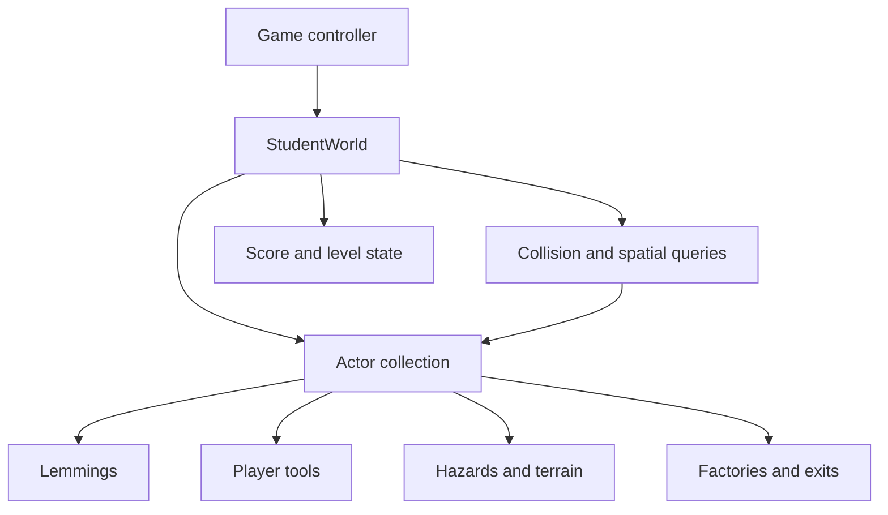

# Lemmings Simulation

Lemmings Simulation is a C++ object-oriented game project built around a per-tick world update loop. The implementation coordinates a polymorphic actor hierarchy, state-driven lemming behavior, interactive tools, hazards, collision rules, scoring, and level progression.

## Architecture

## Core systems

- Actor base class with specialized game-object subclasses
- World-managed initialization, per-tick updates, cleanup, and ownership
- Lemming states for walking, falling, and bouncing
- Collision and position validation across the actor collection
- Interactive trampolines, nets, pheromones, springs, doors, factories, and exits
- Hazard behavior, lemming rescue/death tracking, and level-completion logic
- Keyboard-driven placement of tools through the player actor

## Engineering focus

- Polymorphism and virtual behavior
- State-machine design
- Object lifetime and cleanup
- Event ordering in a real-time update loop
- Spatial queries and interactions between independent actors
- Separation between world orchestration and actor-specific behavior

## Example behavior

When a trampoline and lemming occupy the same position, the world computes a bounce height from the lemming's fall distance. The lemming enters a bouncing state, moves upward until the target height or an obstacle is reached, takes a horizontal step, and returns to falling behavior.

## Technology

- C++
- Object-oriented design
- State machines
- Event-driven simulation
- Xcode project structure

## Repository status

This public repository documents the project without publishing academic starter code, instructor-provided framework files, copyrighted assets, or a complete course solution. Source can be discussed privately when appropriate.

## Author

Arnav Praveen, UCLA Computer Engineering
